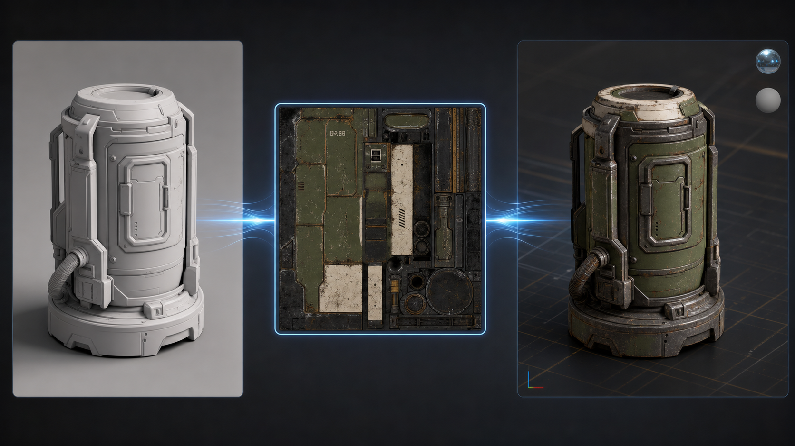
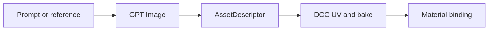

# dcc-ai-openai-image

OpenAI image generation and editing for DCC texture workflows. The skill stays
DCC-neutral: it writes an image and returns an `AssetDescriptor`; Maya,
Blender, Houdini, 3ds Max, Unreal, or another adapter owns UVs, baking, material
creation, and scene import.



## Workflow



## Install

```bash
pip install -e .
set OPENAI_API_KEY=your-key
```

Load `skill/openai-image-textures`, then call:

- `openai-image-textures__generate_texture_source`
- `openai-image-textures__edit_texture_source`

Generated images are creative source material. Derive normal, roughness,
metalness, height, and other physically meaningful maps through DCC baking or
a deterministic texture pipeline.

