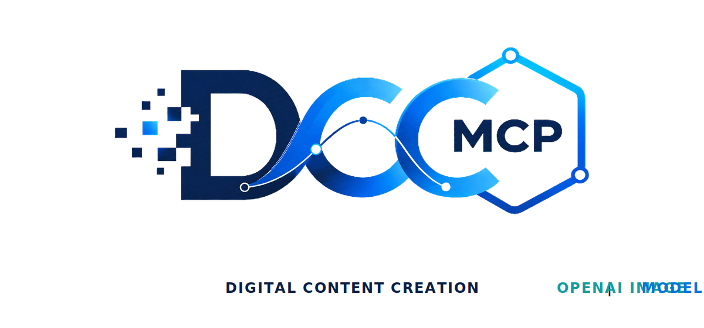
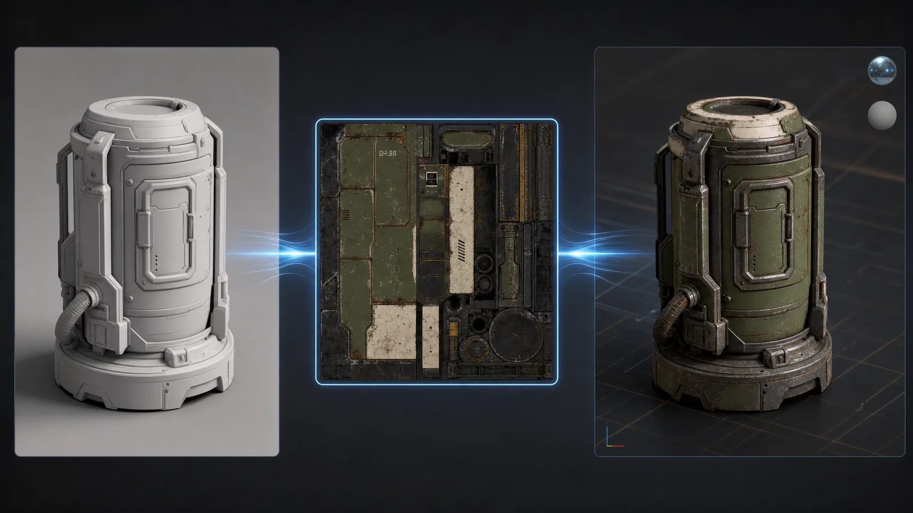
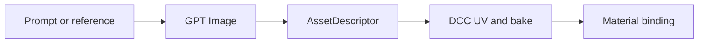

# dcc-ai-openai-image

<p align="center">
  
</p>

## Agent workflow

AI agents should use installed package skills through the shared gateway. IDE
users may continue to use the MCP endpoint.

```bash
dcc-mcp-cli dcc-types
dcc-mcp-cli list
dcc-mcp-cli search --query "<task>" --dcc-type <host>
dcc-mcp-cli describe <tool-slug>
dcc-mcp-cli call <tool-slug> --json '{"key":"value"}'
```

If the package skill is not active, call
`dcc-mcp-cli load-skill <skill-name> --dcc-type <host>`. After the task,
query `dcc-mcp-cli stats --range 24h --session-id <task-id>` and pass only
bounded evidence to the `review_skill_improvement` prompt from
`dcc-mcp-skills-creator`.


OpenAI image generation and editing for DCC texture workflows. The skill stays
DCC-neutral: it writes an image and returns an `AssetDescriptor`; Maya,
Blender, Houdini, 3ds Max, Unreal, or another adapter owns UVs, baking, material
creation, and scene import.



## Workflow



## Install

```bash
pip install -e .
set OPENAI_API_KEY=your-key
```

Load `skill/openai-image-textures`, then call:

- `openai-image-textures__generate_texture_source`
- `openai-image-textures__edit_texture_source`

Generated images are creative source material. Derive normal, roughness,
metalness, height, and other physically meaningful maps through DCC baking or
a deterministic texture pipeline.

