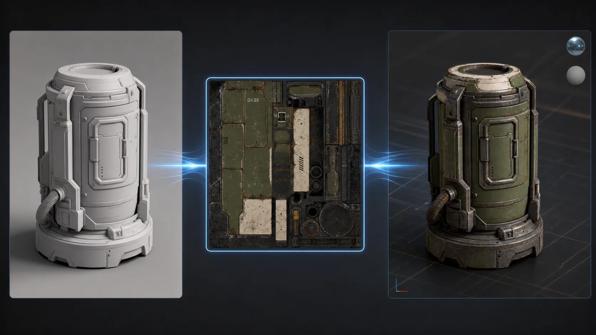

# dcc-ai-openai-image

OpenAI image generation and editing for DCC texture workflows. The skill stays
DCC-neutral: it writes an image and returns an `AssetDescriptor`; Maya,
Blender, Houdini, 3ds Max, Unreal, or another adapter owns UVs, baking, material
creation, and scene import.



## Workflow


```mermaid
flowchart LR
    P[Prompt or reference] --> G[GPT Image]
    G --> A[AssetDescriptor]
    A --> U[DCC UV and bake]
    U --> M[Material binding]
```

## Install

```bash
pip install -e .
set OPENAI_API_KEY=your-key
```

Load `skill/openai-image-textures`, then call:

- `openai-image-textures__generate_texture_source`
- `openai-image-textures__edit_texture_source`

Generated images are creative source material. Derive normal, roughness,
metalness, height, and other physically meaningful maps through DCC baking or
a deterministic texture pipeline.

## PyPI status: not published

This repository is an **agent skill pack**, not a distributable Python package.
It contains no importable module under `src/` — the deliverable is the set of
markdown skill definitions under `skill/`, which agents load from the repository
or the skill marketplace rather than via `pip install`.

It is therefore intentionally **not published to PyPI**, and no release
workflow exists for that purpose. Tracked in [PIP-3630][pip3630].

[pip3630]: https://monica.woa.com/issues/01a0d880-e0c8-7ee2-8f7c-ccc783e279dc
